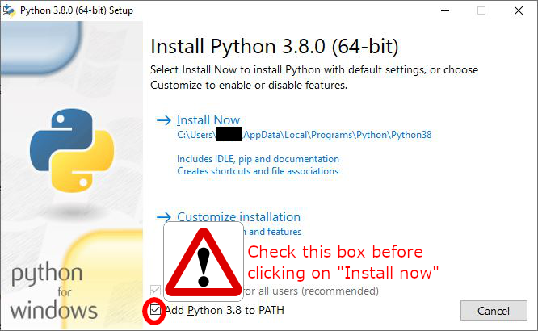
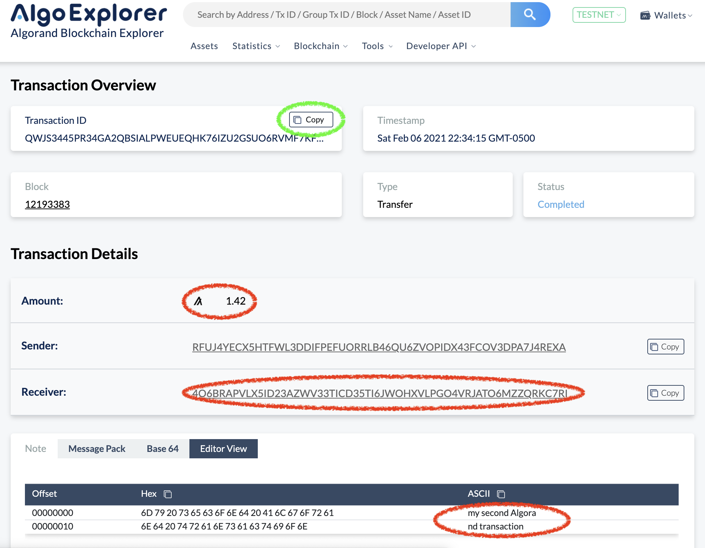
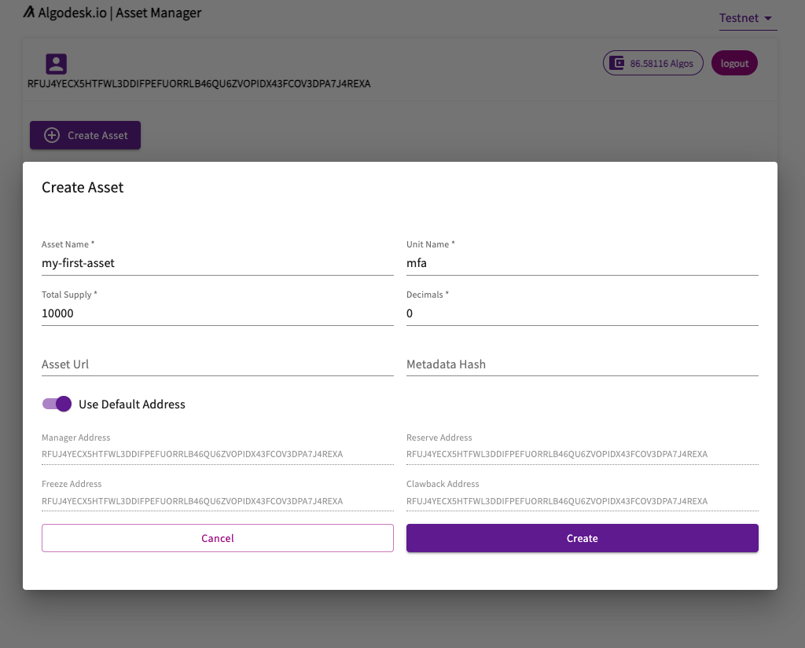
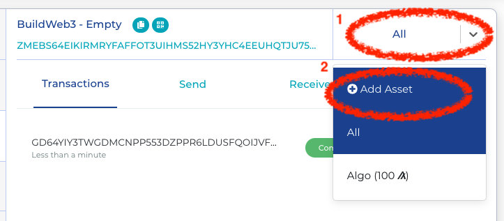
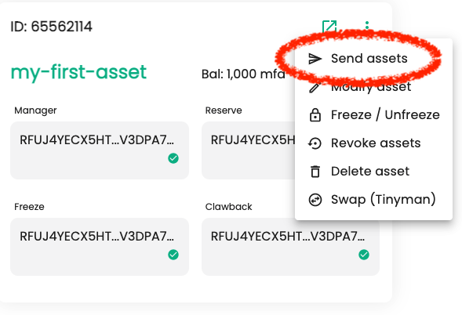
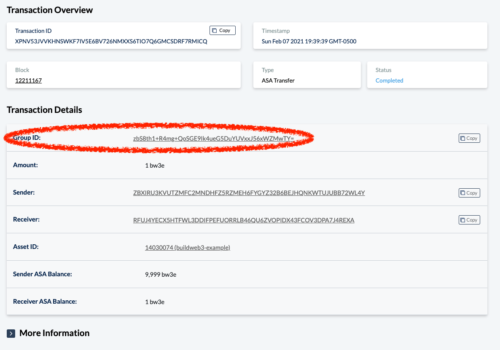
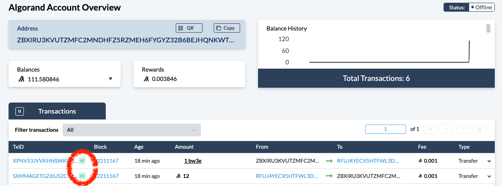

# Homework - Building with Blockchain for Web 3.0 - Algorand Foundation

This is the homework for the Algorand class of "Building with Blockchain for Web 3.0" (https://buildweb3.org).
To do the homework, download the file [form.md](form.md) and fill it out.
Instructions on how to fill it out are provided in the paragraphs **Tasks** below.
See [form.example.md](form.example.md) for a filled-out form example.

In this homework, you will learn:

1. how to create your first Algorand accounts.
2. how to create and distribute your first asset or token on the Algorand blockchain.
3. how to trade your token "atomically" without any third party.
4. how to get the official "buildweb3" asset for just 42 Algos, by using your first stateless smart contract.

The first two goals require *no programming knowledge* and can be done 100% online without installing anything on your computer!
If you are interested, just skip Step 0 and do Steps 1, 2, and 3.

Sections "Background" and "Going Further" are not mandatory to complete the homework but provide information that can be useful to build your project on Algorand.

*Warning*: All the homework is meant to be done on TestNet, where coins (called the Algos) are fake. When switching to MainNet, accounts store real cryptocurrency and proper security of key storage and management needs to be taken into consideration.

*Note*: The answers in [form.example.md](form.example.md) would be valid answers of the homework and you can search for the various accounts and transaction IDs on the block explorer of your choice: [AlgoExplorer](https://testnet.algoexplorer.io) or [GoalSeeker](https://goalseeker.purestake.io/algorand/testnet).

## Step 0 - Setup

If you are only interested in creating your token and not do the full homework, you can skip this section.

### Background

Algorand officially supports 4 Software Development Kits (SDK) for developing applications: Python, Javascript, Java, and Go. Additionally, Algorand has community SDKs for Rust and C#. Algorand also provides many command line tools that are very convenient for larger projects but that are not necessary to install for this homework. See [the developer documentation](https://developer.algorand.org/docs/build-apps/setup/#available-tools) for details.

To access a blockchain, you also need access to an Algorand node and optionally to an Algorand indexer that allows to easily read the blockchain. You can either run those on your computer or use an external API service. See [the developer documentation](https://developer.algorand.org/docs/build-apps/setup/#how-do-i-obtain-an-algod-address-and-token).

### Python SDK and algoexplorer.io

This homework will use the Algorand TestNet network.
TestNet has the same protocol as the main Algorand network MainNet, but uses fake Algos. (The Algo is the native cryptocurrency of the Algorand blockchain.)

In what follows, we give examples with the Python SDK and the [AlgoExplorer API Service](https://testnet.algoexplorer.io/api-dev/v2).
However, you may use the SDK of your choice or the command line tools, and you may also setup a personal node and use it.
In that case, you may skip the instructions on how to install Python and the Python SDK, and instead read [how to setup your workspace in the developer documentation](https://developer.algorand.org/docs/build-apps/setup).

### Step 0.1 - Install Python 3.8 and Pip

*Warning*: Python 2 will not work.

Python 3.8.0 (or later) with Pip must be installed on your computer. You will also need a code editor, such as Visual Studio Code (https://code.visualstudio.com).

* On Windows 7/8/10: (warning: Windows XP is not supported)
    1. Download the Python installer on https://www.python.org/downloads/windows/
    2. In the first screen of the installer, make sure to select the checkboxes "Install launcher for all users" and "Add Python 3.8 to PATH".
    
* On macOS:
    * If you do not have [HomeBrew](https://brew.sh) installed, open a terminal and run:
    ```bash
    curl https://bootstrap.pypa.io/get-pip.py -o get-pip.py
    python3 get-pip.py
    ```
    * If you do use [HomeBrew](https://brew.sh), open a terminal and run:
    ```bash
    brew install python3
    ```
* On Ubuntu 18.04 or later, open a terminal and run:
    ```
    sudo apt update
	sudo apt install python3-pip
    ```

### Step 0.2 - Install the Python SDK

Open a terminal and run:

```bash
python3 -m pip install py-algorand-sdk
```

Troubleshooting:
* If you are using Windows and get an error, replace `python3` by `python` everywhere.
* If you still get an error, check that you added python in the PATH when installing it (see above). If not, uninstall and re-install Python.

## Step 1 - Create Two Algorand Accounts and Fund Them

### Background

In order to send transactions on the Algorand blockchain, you need to create an account.
Basic accounts on Algorand are defined by an *address* (or public key) and a *private key*.

The address is completely public and should be given to anybody who needs to send Algos or other assets/tokens to you for example.

The *private key* is used to authorize transactions from your account by *signing* them. The private key is usually represented by a 25-word mnemonic. It should be kept secret.

### Step 1.1 - Create Two Algorand Accounts

**Task:** Create two Algorand accounts and report the two addresses in [form.md](form.md). The accounts will be called account A and B from now on.

There are many ways of creating Algorand accounts.
For non-developers, the simplest way is to use a wallet such as [My Algo Wallet](https://wallet.myalgo.com/).
After choosing a password, just click on "Add Wallet" and then "Create Wallet" below "New Wallet", and follow the instructions.

For developers, the Python SDK allows you easily to create wallets by running the following code:
```py
import algosdk

# Generate a fresh private key and associated account address
private_key, account_address = algosdk.account.generate_account()

# Convert the private key into a mnemonic which is easier to use
mnemonic = algosdk.mnemonic.from_private_key(private_key)

print("Private key mnemonic: " + mnemonic)
print("Account address: " + account_address)
```
After running the script, you should see:
```plain
Private key mnemonic: six citizen candy robot jacket regular install tell end oven piece problem venture sleep arrow decorate chalk casual patient flat start upset tent abandon bounce
Account address: ZBXIRU3KVUTZMFC2MNDHFZ5RZMEH6FYGYZ32B6BEJHQNKWTUJUBB72WL4Y
```

*Note:* Using My Algo Wallet will enable you to do all Steps 1 to 3. But if you want to be able to do the full homework, you will need to know how to use the Python SDK (or another SDK). In that case, we recommend you generate one account with the SDK and one with My Algo Wallet.

*Note:* Even if you created the account using the SDK, you can then import the mnemonic inside My Algo Wallet, so that you can directly use My Algo Wallets to send transactions. After choosing a password, just click on "Add Wallet" and then "Recover Wallet" below "Mnemonic Phrase", and follow the instructions. 

*Note:* [The developer documentation](https://developer.algorand.org/docs/build-apps/hello_world/#generate-a-publicprivate-key-pair) shows many other ways of creating accounts.

### Step 1.1 - Fund the Two Accounts

**Task:** Add 100 Algos to each of the accounts. The Algo is the native cryptocurrency of the Algorand blockchain.

In order to use your accounts, you need to add Algos to them. On MainNet, you would need to buy them for example on an exchange.
However, on TestNet, you can just use the [dispenser](https://bank.testnet.algorand.network).

For each account, copy the address in the text field, click on/solve the CAPTCHA, and click on Submit.
Refresh the page between each account.

### Step 1.2 - Check the Balance of your Accounts

**Task:** Check that the two accounts now have at least 100 Algos.

To check the balance of an account, go to a block explorer (e.g., [AlgoExplorer](https://testnet.algoexplorer.io) or [GoalSeeker](https://goalseeker.purestake.io/algorand/testnet)), search for your address and look at the balance.

Each account should now have 100 Algos.
If this is not the case, go back to Step 1.1.

Remark that it takes less than 5s for the funding transaction to be committed to the blockchain and the balance to be updated.
Even more importantly, once the transaction appears in the block explorer (i.e., is committed to a block), the transaction is final and cannot be reversed or cancelled.
This is a distinctive property of the Algorand blockchain: **immediate finality**.

### Going Further

You may remark that the balance of your account increases with time.
That is because every account on Algorand receives automatically *participation rewards*.
Note that participation rewards rate on TestNet and MainNet are independent.
See the [Algorand Foundation FAQ](https://algorand.foundation/faq#participation-rewards-) for details.

## Step 2 - Send your First Transactions

**Task:** From accounts A and B, send 1.42 Algos to `4O6BRAPVLX5ID23AZWV33TICD35TI6JWOHXVLPGO4VRJATO6MZZQRKC7RI` with notes `my first Algorand transaction` and `my second Algorand transaction` respectively. Write down the corresponding transaction ID (aka, TxID) of the two transactions in [form.md](form.md).

Any transaction can include an arbitrary "note" of up to 1kB.
In other words, notes allow to store small amount of data on the blockchain.
For this homework, the notes need to be `my first Algorand transaction` and `my second Algorand transaction` respectively.

If your account is in My Algo Wallet, you can send the transactions directly from there.
Be careful to switch the network to TestNet by clicking on the button MainNet in the top right.
To be able to add a note, click on "Advanced Transaction".
See screenshot below.


If you are a developer, we recommend you send at least one transaction using the Python SDK by following the [tutorial "Your First Transaction"](https://developer.algorand.org/docs/build-apps/hello_world/#connect-your-client) starting at step "Connect your client". 
To use the [AlgoExplorer](https://testnet.algoexplorer.io/api-dev/v2) node, define `algod_client` as:
```py
algod_client = algod.AlgodClient(
    algod_token="",
    algod_address="https://api.testnet.algoexplorer.io",
    # see https://github.com/algorand/py-algorand-sdk/issues/169
    headers={"User-Agent": "DoYouLoveMe?"}
)
```
You also need to replace the amount and the note by the correct value.
Note that the amount is specified in microAlgos: 1,000,000 microAlgo = 1 Algo.

You can confirm the two transactions were committed to the blockchain on any block explorer, by searching for the account address and clicking on the relevant transaction.
Check that the amount, the receiver, and the note are correct.
See for example a screenshot using [AlgoExplorer](https://testnet.algoexplorer.io).

Do not forget to copy the transaction ID to [form.md](form.md) (you can use the copy button circled in green).

### Going Further

#### Use Cases of Notes

Beyond adding a memo to a transaction, notes have many use cases. Here are some of them:

* notarization and timestamping of images and digital media to prevent tampering: [Attestive](https://www.algorand.com/resources/news/algorand-announces-insurtech-use-case-attestiv)
* storing anonymous survey data to build the world's first open database for tracking and understanding COVID‑19: [iReport-Covid](https://ireport.algorand.org)
* storing data announcing a vote is taking place (the voting process is handled by a smart contract): [Block'n'Poll](https://github.com/bafio89/blockandpoll)

#### Algorand Indexer v2 and Searching for Notes

The [Algorand Indexer v2](https://developer.algorand.org/docs/features/indexer) allows to make advanced queries on the blockchain, such as searching for transactions, accounts, assets, ... In particular, it allows to search for all transactions with a note with a certain prefix.
The developer website contains a [tutorial about it](https://developer.algorand.org/tutorials/v2-read-and-write-transaction-note-field-python).

If you do not want to install the indexer, you can use the public AlgoExplorer public indexer:
```python
myindexer = indexer.IndexerClient(
    indexer_token="",
    indexer_address="https://api.testnet.algoexplorer.io/idx2",
    # see https://github.com/algorand/py-algorand-sdk/issues/169
    headers={'User-Agent': 'DoYouLoveMe?'}
)
```

#### Transaction Fees

To send a transaction on Algorand, you need to pay a fee. The minimum fee is 0.001 Algo (i.e., 1,000 microAlgos). The required fee may increase in case of congestion. When this homework was written, this never happened.
See the [developer documentation](https://developer.algorand.org/docs/features/transactions/#fees) for details.

## Step 3 - Your Own Custom Token/Asset (ASA)

The Algorand protocol supports the creation of on-chain assets or tokens that benefit from the same security, compatibility, speed and ease of use as the Algo. The official name for assets on Algorand is *Algorand Standard Assets (ASA)*.
ASAs can be used to represent stablecoins, loyalty points, system credits, in-game points, and collectibles, to name just a few. For more details, see [the developer documentation](https://developer.algorand.org/docs/features/asa/).

### Step 3.1 - Create your Asset

**Task:** Create your own asset on Algorand from account A. The creator account must be account A. The total supply (number of tokens) should be at least 10. Choose your preferred asset name and unit name.

Creating an ASA takes less than 1min and can be done 100% online using [AlgoDesk](https://algodesk.io):

1. Go to https://asa.algodesk.io
2. Replace the default mnemonic by the mnemonic for your account A. (Be careful not to add any extra space or line break at the end.)
3. Click on "Create Asset"
4. Choose your preferred asset name, unit name, and total supply (anything above 10 for this homework). See screenshot below.

5. Your asset is created in less than 5s! Report the asset ID and asset name in [form.md](form.md).

You can search for your asset in a block explorer by searching for the asset ID.

If you prefer, you can also create assets using the Python SDK. See the [developer documentation](https://developer.algorand.org/docs/features/asa/#creating-an-asset) or the tutorial [Working with ASA using Python](https://developer.algorand.org/tutorials/asa-python).

### Step 3.2 - Opt-in to the Asset with Account B

Before being able to receive an asset, an account must first opt in to the asset.

**Task:** Make account B opt in to the asset you created. Report the opt-in transaction ID on [form.md](form.md).

If you are using My Algo Wallet, just go the account B wallet, click on "All" at the top right, then click on "Add Asset", enter the asset ID, and follow the instructions.
See screenshot below:


An asset opt-in is just an asset transaction of 0 asset from the account to itself and can be seen on any block explorer.

If you are a developer, you can also send the opt-in transaction using the Python SDK. See the [developer documentation](https://developer.algorand.org/docs/features/asa/#receiving-an-asset) or the tutorial [Working with ASA using Python](https://developer.algorand.org/tutorials/asa-python).

### Step 3.3 - Sending 1 Asset to Account B

Now that account B opted in the asset, you can send 1 asset unit from account A to account B.

**Task:** Send 1 asset unit from account A to account B. Report the transaction ID on [form.md](form.md)

If you are using My Algo Wallet, just go the account A wallet, click on "All" at the top right, then click on the new asset, and click on "Send" to create a transaction of 1 asset from A to B.

You can also use https://asa.algodesk.io by clicking on the three dots at the top right of the asset box and on "Send Assets". See screenshot below:


If you are a developer however, we recommend that you send the asset transfer transaction using the Python SDK. See the [developer documentation](https://developer.algorand.org/docs/features/asa/#transferring-an-asset) or the tutorial [Working with ASA using Python](https://developer.algorand.org/tutorials/asa-python).

### Going Further

#### Minimum Balance

Any Algorand account must keep a minimum balance of 0.1 Algo. This is to prevent malicious people to create too many accounts, which could make the size of the account table (stored by all the nodes of the blockchain) explodes.
For every asset an account opts in or creates, the minimum balance is increased by 0.1 Algo.

See the [developer documentation](https://developer.algorand.org/docs/features/asa/#assets-overview) for more details.

## Step 4 - Trade Assets via Atomic Transfer

*Note:* All the previous steps could be done without any programming knowledge. From now on, programming or command line knowledge is necessary.

In the previous steps, we have seen how to transfer Algos, create assets, and transfer assets.
In many situations however, we need to trade or exchange x asset for y Algos (or y other assets).
For example account A may sell its asset to account B instead of giving it away.
One solution is just to have account B first send some Algos to pay for the asset, and then account B to send the asset.
But then account B cannot be sure account A will not run with the money.

Atomic transfers completely solve this issue.
Atomic transfers allow to group two transactions (transfer of asset from A to B, and transfer of Algos from B to A) in such a way that:

* either both transactions are successful: A gets its Algos and B gets its asset;
* or both transactions fail: A keeps it asset and B keeps its Algos.

**Task:** Make an atomic transfer where account B sends 12 Algos to account A and account A send 1 asset to account B. Report the transaction ID of the first transaction of the atomic transfer on [form.md](form.md)

Follow the [tutorial on the developer documentation](https://developer.algorand.org/docs/features/atomic_transfers).
Concretely, your Python script needs to:

1. Create a payment transaction of 12 Algos from B to A (like in Step 2). Do not sign it yet.
2. Create an asset transfer of 1 asset from A to B (like in Step 3.3). Do not sign it yet.
3. Group the two transactions together. Note that this modifies the transactions to ensure that one cannot be committed without the other. See [the developer documentation](https://developer.algorand.org/docs/features/atomic_transfers/#group-transactions).
4. Sign the first transaction using the private key of account B (like in Step 2).
5. Sign the second transaction using the private key of account A (like in Step 3.3).
6. Send both transactions together. See [the developer documentation](https://developer.algorand.org/docs/features/atomic_transfers/#assemble-transaction-group).
7. Check on a block explorer that the group transaction was committed properly.

On [AlgoExplorer](https://testnet.algoexplorer.io) you can see that transactions are grouped in two ways:

1. Each transaction of the group has a group ID, which links to a page with all the transactions of the group. See screenshot below:

2. If multiple transactions in a group involves the same account, on the account page there is a small icon next to the transactions. See screenshot below:


If you do not see the above, it means you sent two independent transactions instead of making an atomic transfer.

## Step 5 - Automating Trading

While atomic transfers are very useful to trade assets, they require each account involved in the trade to sign the transactions.
In some cases, you may want to allow anybody to trade assets with you without having to sign transactions.
Layer-1 stateless smart contracts allow to make an account automatically approve transactions that follow some criteria.

To show the power of layer-1 smart contracts, we created an exclusive asset for the class "buildweb3" and provided a layer-1 smart contract that will allow you to receive 1 unit of the asset for just 42 Algos!
The smart contract approves transactions of 1 unit of the asset if it is in a group of 2 transactions (aka atomic transfer) where:
1. the first transaction sends 42 Algos to the smart contract (this transaction is signed by your account),
2. the second transaction sends 1 unit of the asset "buildweb3" from the smart contract (this transaction is approved by the smart contract rather than being signed).

### Step 5.1 - Opt-in to the Exclusive Asset "buildweb3"

**Task:** Make account A opt in to the asset "buildweb3" with ID 14035004. Report the opt-in transaction ID on [form.md](form.md).

Remember that opt-in transactions were covered in Step 3.3.

### Step 5.2 - Receive 1 "buildweb3" Asset

**Task:** Make an atomic transfer of 42 Algos from account A to `4O6BRAPVLX5ID23AZWV33TICD35TI6JWOHXVLPGO4VRJATO6MZZQRKC7RI` and of 1 "buildweb3" asset (ID 14035004) from `4O6BRAPVLX5ID23AZWV33TICD35TI6JWOHXVLPGO4VRJATO6MZZQRKC7RI` to account A, where the second transaction is signed using the [signed smart contract (aka delegated logic sig)](step5.lsig).

This task is similar to Step 4, except that the second transaction is signed using a delegated logic sig instead of a normal signature.
Concretely, assume `txn2` is the second transaction of your atomic transfer
Instead of signing it with `stxn2 = txn2.sign(private_key)`, you do the following:
```py
with open("step5.lsig", "rb") as f:
    lsig = encoding.future_msgpack_decode(base64.b64encode(f.read()))
stxn2 = LogicSigTransaction(txn2, lsig)
```

The full script should look like:
```py
import base64

from algosdk import mnemonic, encoding
from algosdk.v2client import algod
from algosdk.future import transaction
from algosdk.future.transaction import LogicSigTransaction, PaymentTxn, AssetTransferTxn

# Setup algod_client and global variables
...

# Get the suggested parameters
params = algod_client.suggested_params()

# Create the two transactions
txn1 = PaymentTxn(...)
txn2 = AssetTransferTxn(...)

# Group the two transactions
...

# Sign both transactions
stxn1 = txn1.sign(...)
with open("step5.lsig", "rb") as f:
    lsig = encoding.future_msgpack_decode(base64.b64encode(f.read()))
stxn2 = LogicSigTransaction(txn2, lsig)

# Assemble the signed group
signed_group = [stxn1, stxn2]

# Send the signed group
txid = algod_client.send_transactions(signed_group)

# Print the transaction ID of the first transaction of the group
print("Send transaction with txID: {}".format(txid))
```

This concludes the homework! :fireworks:

### Going Further

#### Smart Contract Accounts vs Delegated Logic Sig

The stateless smart contract in Step 5 is used as a delegated logic sig: it allows a normal account to delegate some abilities to anyone. 
Here the ability is to send 1 unit of asset in an atomic transfer where the first transaction pays 42 Algos.
Anybody knowing the private key of the underlying account can sign arbitrary transactions without any restriction.
A delegated logic sig is essentially a compiled smart contract signed by the private key of the underlying account.

Algorand also supports more classical smart contract accounts.
Smart contract accounts are accounts that are only controlled by a smart contract.
All transactions must be approved by the smart contract and there is no associated private key.

See [the developer documentation](https://developer.algorand.org/docs/features/asc1/stateless/modes) for details.

#### Explanation on How the Smart Contract Works

The actual smart contract is [step5.teal](step5.teal).
It was generated using [PyTeal](https://github.com/algorand/pyteal) that simplifies the writing of TEAL scripts, the language of layer-1 smart contracts on Algorand.
In other words, [step5.teal](step5.teal) is the output of [step5.teal.py](step5.teal.py).

Concretely, to generate `step5.lsig`, the secret key of  `4O6BRAPVLX5ID23AZWV33TICD35TI6JWOHXVLPGO4VRJATO6MZZQRKC7RI` was added to `kmd` using `goal account import`, and then the following commands were run:
```bash
python3 step5.teal.py > step5.teal
goal clerk compile -a 4O6BRAPVLX5ID23AZWV33TICD35TI6JWOHXVLPGO4VRJATO6MZZQRKC7RI -s step5.teal -o step5.lsig
```
This assumes that PyTeal is installed via `python3 -m pip pyteal` and that the [Algorand Command Line Interface Tools](https://developer.algorand.org/docs/build-apps/setup/#command-line-interface-cli-tools) were installed.

#### Stateful Smart Contracts

The smart contracts described previously are used to approve or reject transactions.
They cannot store any variables / state on the blockchain.

Algorand also has stateful smart contracts.
See [the developer documentation](https://developer.algorand.org/docs/features/asc1/stateful/) for details.
The developer websites contain several examples of stateful smart contracts on Algorand:
* [Voting dApp](https://developer.algorand.org/solutions/example-permissioned-voting-stateful-smart-contract-application/).
* [Crowdfunding smart contract](https://developer.algorand.org/solutions/example-crowdfunding-stateful-smart-contract-application/) and its [associated frontend](https://developer.algorand.org/solutions/creating-crowdfunding-application-algorand-blockchain/).

#### Other Tools

Many tools have been developed by the community to facilitate development over Algorand. 
The developer website contains [a list of them](https://developer.algorand.org/docs/community).
Here we highlight some:
* Block explorer: https://goalseeker.purestake.io, https://algoexplorer.io
* Create your first token and smart contract without installing anything on your computer:
https://algodesk.io
* Interactive online tutorial: https://algorand.rockx.com
* IDE: VSCode, IntelliJ Idea, Algorand Studio, ...
* Free API services: https://api.algoexplorer.io,
https://www.purestake.com/technology/algorand-api (equivalent to Infura for people from
the Ethereum world)
* Wallet for distributed applications: https://www.purestake.com/technology/algosigner
(equivalent of MetaMask for people from the Ethereum world)
* Write distributed applications in a JavaScript-like language: https://reach.sh (bonus:
same code works on Ethereum)
* Automate development of smart contracts and assets:
https://github.com/scale-it/algorand-builder